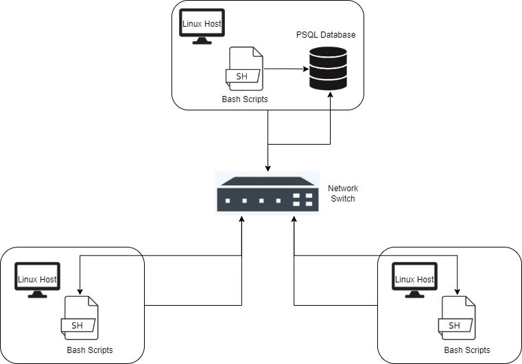

# Linux Cluster Monitoring Agent
# Introduction
The Linux Cluster Monitoring Agent is used to allow users to monitor server node usage in a Linux cluster by tracking relevant information (e.g. current free memory, CPU utilization, etc.) for each host. This could be used by companies that would like to know whether or not their Linux cluster is evenly utilizing system resources, so that they can optimize server usage allocation. For example, if ¾ nodes are running close to 90% CPU utilization, while ¼ nodes are only around 20% on average, then the company can allocate more resources to be run on the latter. This project used bash scripting and crontab to automate host usage information, database setup, etc. Data was persisted using a PostgreSQL instance on Docker, and Git Flow branching methodology was used to ensure smooth releases.   

# Quick Start
1. First, we need to initialize the database. Let's use the ```psql_docker.sh``` script:
```bash
./scripts/psql_docker.sh create [db_username][db_password]
```
```db_username``` and ```db_password``` refers to the databases' username and password, respectively. Once this line is run, we can move on to the next step (if you get an error here, please check the error message for information on what went wrong).

Next, we need to start the database:
```bash
./scripts/psql_docker.sh start
```
The database should be running on Docker now, and to stop the container, simply use the following command:
```bash
./scripts/psql_docker.sh stop
```

2. Now, we need to create the tables in the database using the ```ddl.sql``` script:
```bash
psql -h localhost -U postgres -d host_agent -f sql/ddl.sql
```

3. Next, we insert a node's hardware information into the database using ```host_info.sh```. This script is only run once on each node, as we only need to record this information once:
```bash
./scripts/host_info.sh psql_host psql_port db_name psql_user psql_password
```
```psql_host```, ```psql_port```, ```db_name```, ```psql_user```, ```psql_password``` refers to the Postgres host, Postgres port, database name, Postgres username, and Postgres password respectively.

4. This script (```host_usage.sh```) records a snapshot of the current node's usage. It can be run manually from the CLI to record hardware usage data into the database:
```bash
./scripts/host_usage.sh psql_host psql_port db_name psql_user psql_password
```
Where all arguments represent the same thing as in the previous script.

5. Finally, we can automate our usage script's updates using Crontab. Here is how to set this up:
```bash
#First, cd into the script directory
cd script/

#Copy the output of pwd
pwd

#Then, edit your crontab jobs
crontab -e

#Add the following line to the file, replacing PATH_COPIED with the path that you copied from before
* * * * * bash PATH_COPIED/host_usage.sh localhost 5432 host_agent postgres password > /tmp/host_usage.log

#Check that the crontab job shows up here:
crontab -l

#Finally, login to the database and check that the results show (see below)
psql -h psql_host -d db_name -U postgres -W
```
```sql
SELECT * FROM host_usage;
```

# Implementation
The project was implemented using Git Flow branching methodology, so feature branches were made for each user story (e.g. feature/readme was used for this README file). IntelliJ was used as the IDE for development and testing for all code, including the bash scripts, and SQL-related files. Docker provided the container for the PostgreSQL database, so the psql shell was essential for testing table creation and insertion, and the specific queries themselves. By the same token, bash scripts were prototyped using the CLI to ascertain their success. Once the develop branch had enough features for a releasable state, a pull request was made to the release branch, with an accompanying code review by a senior developer. Finally, the pull request to master was made with this finished product, and a master code review was conducted, also by a senior developer. 

## Architecture
This diagram illustrates three separate Linux hosts, or "nodes", the PostgreSQL database, and the agents (denoted as bash scripts). To view this diagram by itself, please see the `assets` directory.




## Scripts
A general description, and usage for each script. 
1. `psql_docker.sh`
This script is used to create a psql docker container, and start/stop the running container. Here is its usage:
```bash
./scripts/psql_docker.sh create [db_username][db_password]
```
```db_username``` and ```db_password``` refers to the databases' username and password, respectively. Once this line is run, we can move on to the next step (if you get an error here, please check the error message for information on what went wrong).

Starting the database:
```bash
./scripts/psql_docker.sh start
```
Stopping the database:
```bash
./scripts/psql_docker.sh stop
```
2. `host_info.sh`
This script is used to record a server node's hardware specification in the database, so it only needs to be run once per node. Here is its usage:
```bash
./scripts/host_info.sh psql_host psql_port db_name psql_user psql_password
```
```psql_host```, ```psql_port```, ```db_name```, ```psql_user```, ```psql_password``` refers to the Postgres host, Postgres port, database name, Postgres username, and Postgres password respectively.
3. `host_usage.sh`
This script is used to record server node usage information in the database, so it can be run manually or automated with crontab. Here is its usage:
```bash
./scripts/host_usage.sh psql_host psql_port db_name psql_user psql_password
```
```psql_host```, ```psql_port```, ```db_name```, ```psql_user```, ```psql_password``` refers to the Postgres host, Postgres port, database name, Postgres username, and Postgres password respectively.
4. `crontab`
Crontab is the tool used to automate host usage statistics. Here is its usage:
```bash
#First, cd into the script directory
cd script/

#Copy the output of pwd
pwd

#Then, edit your crontab jobs
crontab -e

#Add the following line to the file, replacing PATH_COPIED with the path that you copied from before
* * * * * bash PATH_COPIED/host_usage.sh localhost 5432 host_agent postgres password > /tmp/host_usage.log

#Check that the crontab job shows up here:
crontab -l

#Finally, login to the database and check that the results show (see below)
psql -h psql_host -d db_name -U postgres -W
```
```sql
SELECT * FROM host_usage;
```
5. `queries.sql`
This script aims to answer some common business questions. Namely, "1. Can we group hosts by their hardware information, to better organize our cluster?", "2. Can we retrieve average memory usage over 5 minute intervals, to see which nodes are underperforming or over performing?", and "3. Can we detect when a host failed to report its usage, to determine errors within our cluster?". There are queries made within the script that provides meaningful data to answers these specific questions.

## Database Modelling
- The schema for `host_info`:

| Attribute        | Meaning                                                                                                  |
|------------------|----------------------------------------------------------------------------------------------------------|
| `id`               | This is the unique id for each server node, making it the Primary key, and auto-incremented using SERIAL |
| `hostname`         | The unique full name of the server node                                                                         |
| `cpu_number`       | The logical CPU number of a CPU as used by the Linux kernel                                              |
| `cpu_architecture` | The specific CPU architecture of this node                                                               |
| `cpu_model`        | The model name of this CPU                                                                               |
| `cpu_mhz`          | The clock rate of this CPU in MHz                                                                        |
| `L2_cache`         | The amount of L2 cache in this CPU in KB                                                                 |
| `total_mem`        | The total amount of system memory in KB                                                                  |
| `timestamp`        | The timestamp snapshot of when this information was recorded                                             |

- The schema for `host_usage`:

| Attribute        | Meaning                                                             |
|------------------|---------------------------------------------------------------------|
| `timestamp`      | The timestamp snapshot of when this information was recorded        |
| `host_id`        | The foreign key that references the `id` primary key in `host_info` |
| `memory_free`    | The amount of free memory of the node in MB                         |
| `cpu_idle`       | The percentage uptime of the CPU in idle state                      |
| `cpu_kernel`     | The percentage uptime of the CPU in kernel mode                     |
| `disk_io`        | The number of disk I/O made                                         |
| `disk_available` | The amount of disk space available from the root directory in MB    |
# Test
How did you test your bash scripts and SQL queries? What was the result?
CI/CD was not setup for this project, so testing involved mostly just running different edge cases to check that everything was running correctly. For the bash scripts this meant running them in the CLI using `bash -x script` to debug when errors were presented. As for the SQL queries, IntelliJ Ultimate's database tool was used as a GUI client to help construct queries, but ultimately the queries were tested in the psql shell. The results from the shell were compared against the expected output to test for correctness. The result of this testing found numerous bugs/errors that were later fixed.

# Deployment
This tool is deployable through downloading this GitHub repo, docker, and crontab. Then, follow the `Quick Start` guide to deploy the tool on your server node(s) for your Linux cluster.

# Improvements
- Improve SQL queries

In all likelihood, there are simpler/better performing SQL queries that accomplish the same task as described in the `Scripts` section. It would be nice to improve this project with updated streamlines queries, or even more queries, to better serve businesses needs.

- Expand host usage summary statistics

This project already records highly relevant data for server node host information/usage, however it may not be enough information to answer all questions a business may have for its Linux cluster. What if their cluster uses GPUs for compute tasks like machine learning? It would be nice to update the relevant tables with this information, to cover for this.

- Make the tool more beginner-friendly (GUI)

This tool assumes that the user has some underlying technical knowledge in order to make use of it, so simplifying the knowledge requirements by making a GUI for the tool would make it more approachable to the public. Of course, keeping the CLI usage would be a priority for users who already have the prerequisite knowledge for this tool.
